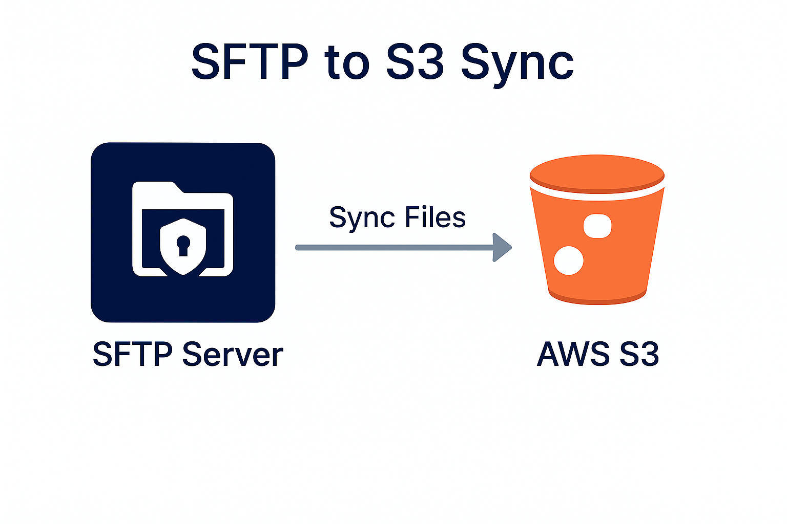

# sftp2s3



**sftp2s3** is a minimal Python tool to **synchronize files from an SFTP server to an Amazon S3 bucket**. It supports custom SFTP ports and local S3 endpoints (e.g., MinIO), making it versatile for various deployment scenarios.

It supports incremental synchronization to avoid redundant uploads, making it ideal for lightweight and efficient transfers.

---

## Features

- 🔄 Syncs new or updated files from SFTP to S3
- 📄 Recursive directory scanning
- ⚡ Incremental sync using last modified timestamps
- 🛠️ Simple configuration via YAML file and environment variables
- 🔒 Secure SFTP connection (Paramiko)

---

## Requirements

- Python 3.8 or higher
- boto3
- paramiko
- PyYAML
- click

## Installation

You can install the tool in two ways:

- Install via GitHub directly: `pip install git+https://github.com/daviguides/sftp2s3.git`

### Manual Installation

Clone the repository and run either:

```bash
pip install ".[dev]"
```

or

```bash
make install-dev
```

---

## Configuration

Create a `config.conf` file (YAML format) with your settings:

```yaml
s3:
  bucket: your-s3-bucket-name
  key_prefix: optional-prefix/
  aws_access_key_id: your-aws-access-key
  aws_secret_access_key: your-aws-secret-key
  endpoint_url: optional-s3-endpoint-url

sftp:
  hostname: your.sftp.server
  username: your-username
  password: your-password
  port: optional-sftp-port

incremental_sync:
  last_modified_s3_key: path/to/last_sync_marker.txt
```

You can also override any value with environment variables if needed.

---

## Usage

Run the sync process:

```bash
sftp2s3 --config-file ./config.conf
```

By default, it will:

- Connect to the SFTP server.
- Recursively list files.
- Upload only new or modified files to S3.
- Update the incremental sync marker.

You can also specify the `--log-level` parameter for logging verbosity.

---

## Makefile Commands

- `make install`: Install only production dependencies
- `make install-dev`: Install production + development dependencies
- `make format`: Format code using Ruff
- `make lint`: Lint code using Ruff
- `make test`: Run tests with pytest
- `make run`: Run the sftp2s3 sync
- `make setup-config`: Copy `config.example.yaml` to `config.yaml`

---

## License

This project is licensed under the [MIT License](LICENSE).

---

## Future Improvements

- Add support for polling mode (automatic periodic sync)
- Add support for multipart uploads for large files
- Add logging system instead of standard prints
